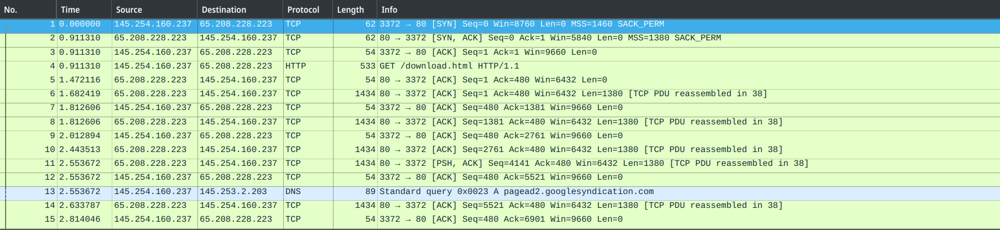
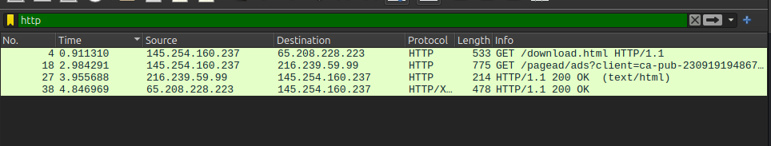

# Tugas Workshop Administrasi Jaringan [REVIEW]

## Tugas 1: Analisa file http.cap

### 1. Download File
- Download `http.cap` di [SampleCaptures](https://wiki.wireshark.org/SampleCaptures)

### 2. Langkah-langkah Pengerjaan
- Buka Wireshark dan load file `http.cap`
- Gunakan filter untuk menampilkan paket HTTP
- Analisis setiap paket untuk mendapatkan informasi yang diminta
- Catat hasil analisis dalam dokumen

### 3. Eksplorasi dan Analisis di Wireshark

#### IP Server dan Client
- IP Server: 65.208.228.223
- IP Client: 145.254.160.237

#### Versi HTTP
- Menggunakan HTTP versi 1.1 (HTTP/1.1)

#### Analisis Waktu
- Waktu client mengirim request: 0.911310 detik
- Waktu server menerima request: Selisih antara baris 5 (1.472 sec) dan 4 (0.911 sec) = 0.561 detik
- Waktu transfer dan response total: 3.935659 detik
  - Waktu client mengirim request: 0.911310 detik (paket #4)
  - Waktu server mengirim response: 4.846969 detik (paket #38)
  - Total waktu: 4.846969 - 0.911310 = 3.935659 detik

## Tugas 2: Analisis Gambar Types of Data Deliveries

### 1. Node to Node (Data Link Layer)
Node-to-node communication adalah proses komunikasi langsung antara dua perangkat dalam jaringan yang berada dalam satu segmen jaringan yang sama. Komunikasi ini menggunakan protokol pada Data Link Layer (Lapisan 2 dalam model OSI), seperti Ethernet, untuk memastikan data dapat dikirim tanpa perlu melewati perantara seperti router. Identifikasi perangkat dalam komunikasi ini dilakukan menggunakan alamat MAC (Media Access Control), yang merupakan alamat unik yang dimiliki setiap perangkat jaringan. Karena berbasis pada protokol Data Link Layer, komunikasi ini umumnya terjadi dalam jaringan lokal (LAN) dan memungkinkan perangkat untuk bertukar data dengan cepat dalam satu segmen jaringan tanpa perlu melibatkan alamat IP atau routing.

### 2. Host to Host (Network Layer)
Host-to-host communication pada Network Layer (Lapisan 3 dalam model OSI) adalah proses komunikasi end-to-end antara dua perangkat di jaringan yang bisa berada dalam jaringan yang berbeda. Komunikasi ini menggunakan Internet Protocol (IP) sebagai mekanisme utama untuk mengidentifikasi dan mengarahkan paket data dari satu host ke host lainnya, bahkan jika mereka berada di lokasi geografis yang berjauhan. Berbeda dengan komunikasi node-to-node yang terbatas pada satu segmen jaringan, host-to-host communication memungkinkan data melewati beberapa jaringan dengan bantuan perangkat perantara seperti router. Selama perjalanan, paket data akan melalui path lengkap melalui internet, melewati berbagai jaringan dan hop sebelum mencapai tujuan akhirnya, di mana data kemudian diteruskan ke aplikasi yang sesuai pada perangkat penerima.

### 3. Process to Process (Transport Layer)
Process-to-process communication adalah bentuk komunikasi dalam jaringan yang memungkinkan aplikasi pada satu perangkat berinteraksi langsung dengan aplikasi di perangkat lain. Komunikasi ini terjadi pada Transport Layer (Lapisan 4 dalam model OSI) dan menggunakan protokol seperti TCP (Transmission Control Protocol) untuk koneksi yang andal atau UDP (User Datagram Protocol) untuk komunikasi yang lebih cepat namun tanpa jaminan keandalan. Untuk memastikan data dikirim ke aplikasi yang benar, sistem menggunakan port number sebagai identitas unik setiap layanan atau proses yang berjalan di suatu perangkat. Misalnya, port 80 digunakan untuk HTTP dan port 443 untuk HTTPS, sehingga browser dapat berkomunikasi dengan server web yang tepat tanpa terjadi kesalahan rute dalam pertukaran data.

## Tugas 3: Resume Tahapan TCP

### 1. TCP Establishment (Three-Way Handshake)
1. **Langkah 1 (SYN)**
   - Client mengirim paket SYN ke server
   - Berisi sequence number awal acak (SEQ=100)
   - Flag SYN = 1

2. **Langkah 2 (SYN-ACK)**
   - Server merespon dengan paket SYN-ACK
   - Berisi acknowledgment (ACK=101)
   - Sequence number server (SEQ=300)
   - Flag SYN dan ACK = 1

3. **Langkah 3 (ACK)**
   - Client mengirim ACK final
   - Berisi acknowledgment (ACK=301)
   - Koneksi siap untuk transfer data

### 2. Data Transfer

#### Segmentasi
- Data dipecah menjadi segmen-segmen kecil
- Setiap segmen memiliki sequence number
- Maximum Segment Size (MSS) menentukan ukuran maksimal

#### Flow Control
- Menggunakan sliding window
- Receiver window menunjukkan kapasitas buffer penerima
- Mencegah overloading pada penerima

#### Error Control
- Menggunakan checksums untuk deteksi error
- Retransmission untuk segmen hilang/rusak
- Acknowledgment untuk konfirmasi penerimaan

### 3. TCP Termination (Four-Way Handshake)

1. **Langkah 1 (FIN)**
   - Client mengirim FIN ke server
   - Menandakan client selesai mengirim data
   - Client masih bisa menerima data

2. **Langkah 2 (ACK)**
   - Server mengirim ACK untuk FIN client
   - Server masih bisa mengirim data
   - Client menunggu FIN dari server

3. **Langkah 3 (FIN)**
   - Server mengirim FIN ke client
   - Menandakan server juga selesai
   - Semua data sudah terkirim

4. **Langkah 4 (ACK)**
   - Client mengirim ACK terakhir
   - Koneksi terputus setelah timeout
   - Resources dibebaskan