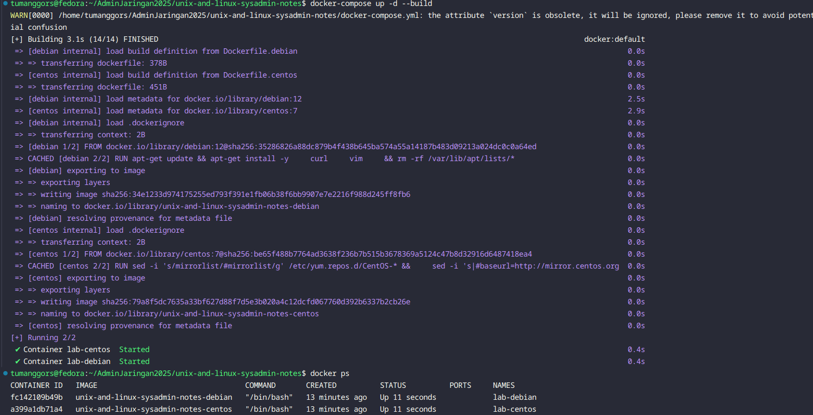
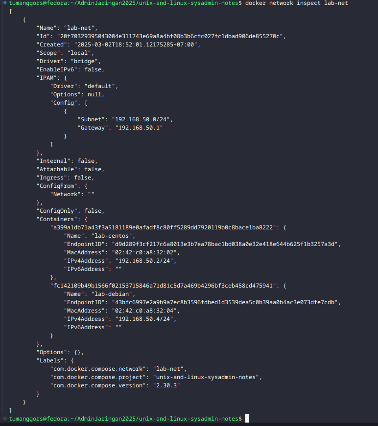

# Process Control di UNIX/Linux

## Daftar Isi
- [Pendahuluan](#pendahuluan)
- [Memulai Lab](#memulai-lab)
- [Konsep Dasar Process Control](#konsep-dasar-process-control)
  - [Anatomi Proses](#anatomi-proses)
  - [Siklus Hidup Proses](#siklus-hidup-proses)
  - [Status Proses](#status-proses)
  - [Sinyal (Signals)](#sinyal-signals)
- [Perintah-perintah Dasar](#perintah-perintah-dasar)
  - [Melihat Proses](#melihat-proses)
  - [Mengelola Proses](#mengelola-proses)
  - [Job Control](#job-control)
  - [Prioritas Proses](#prioritas-proses)
- [Daemon dan Service](#daemon-dan-service)
- [Latihan Praktik](#latihan-praktik)
  - [Latihan 1: Mengelola Proses](#latihan-1-mengelola-proses)
  - [Latihan 2: Prioritas Proses](#latihan-2-prioritas-proses)
  - [Latihan 3: Sinyal dan Handling](#latihan-3-sinyal-dan-handling)
- [Kesimpulan](#kesimpulan)
- [Struktur Direktori](#struktur-direktori)
- [Referensi](#referensi)
- [Kontributor](#kontributor)
- [Lisensi](#lisensi)

## Pendahuluan

Komponen dari Sebuah Proses

Sebuah proses terdiri dari address space dan serangkaian struktur data di dalam kernel. address space adalah sekumpulan halaman memori yang telah ditandai oleh kernel untuk digunakan oleh proses tersebut. (Halaman adalah unit di mana memori dikelola. Biasanya berukuran 4KiB atau 8KiB.) Halaman-halaman ini digunakan untuk menyimpan kode, data, dan stack dari proses. Struktur data di dalam kernel melacak status proses, prioritasnya, parameter penjadwalannya, dan sebagainya.

Proses seperti wadah untuk sekumpulan sumber daya yang dikelola oleh kernel atas nama program yang sedang berjalan. Sumber daya ini termasuk halaman memori yang menyimpan kode dan data program, deskriptor file yang merujuk ke file yang terbuka, dan berbagai atribut yang menggambarkan status proses.

Struktur data internal kernel mencatat berbagai informasi tentang setiap proses:

- Peta proses address space
- Status saat ini dari proses (berjalan, tidur, dan sebagainya)
- Prioritas proses
- Informasi tentang sumber daya yang telah digunakan oleh proses (CPU, memori, dan sebagainya)
- Informasi tentang file dan port jaringan yang telah dibuka oleh proses
- Masker sinyal proses (set sinyal yang saat ini diblokir)
- Pemilik proses (ID pengguna dari pengguna yang memulai proses)

Sebuah "thread" adalah konteks eksekusi di dalam sebuah proses. Sebuah proses dapat memiliki beberapa thread, yang semuanya berbagi address space dan sumber daya lainnya. Thread digunakan untuk mencapai paralelisme di dalam sebuah proses. Thread juga dikenal sebagai proses ringan karena jauh lebih murah untuk dibuat dan dihancurkan dibandingkan dengan proses.

Sebagai contoh untuk memahami konsep proses dan thread, pertimbangkan sebuah server web. Server web mendengarkan koneksi yang masuk dan kemudian membuat thread baru untuk menangani setiap permintaan yang masuk. Setiap thread menangani satu permintaan pada satu waktu, tetapi server web secara keseluruhan dapat menangani banyak permintaan secara bersamaan karena memiliki banyak thread. Di sini, server web adalah sebuah proses, dan setiap thread adalah konteks eksekusi terpisah di dalam proses tersebut.

## Memulai Lab

1. Masuk ke direktori `/unix-and-linux-sysadmin-notes/`
2. Jalankan perintah berikut untuk memulai environment lab:
   ```bash
   docker-compose up -d --build
   ```
3. Pastikan container dan network sudah berhasil dibuat:
    
    
3. masuk ke container lab:

untuk percobaan ini kita akan menggunakan lab-debian/

   ```bash
   docker exec -it lab-debian bash
   ```

## Konsep Dasar Process Control

### Anatomi Proses

Proses di Unix/Linux memiliki beberapa karakteristik penting:

- **PID (Process ID)**: Pengenal unik untuk setiap proses
- **PPID (Parent Process ID)**: ID dari proses induk yang membuat proses tersebut
- **UID dan GID**: User ID dan Group ID yang menjalankan proses
- **Prioritas dan jadwal eksekusi**: Menentukan kapan dan seberapa sering proses mendapat jatah CPU
- **Working directory**: Direktori kerja dari proses
- **Environment variables**: Variabel lingkungan yang tersedia untuk proses
- **Handlers**: Rutinitas untuk menangani berbagai sinyal
- **File descriptor**: Pointer ke file, socket, dan resources lain

### Siklus Hidup Proses

1. **Pembuatan Proses**:
   - Proses dibuat melalui system call `fork()` yang membuat duplikat (child) dari proses yang memanggilnya (parent)
   - Child process biasanya melanjutkan dengan system call `exec()` untuk mengganti program yang dieksekusi

2. **Eksekusi**:
   - Proses aktif berjalan di CPU
   - Dijadwalkan oleh kernel berdasarkan prioritas dan algoritma penjadwalan

3. **Terminasi**:
   - Proses dapat berakhir normal dengan system call `exit()`
   - Proses dapat dihentikan paksa dengan sinyal seperti SIGKILL

### Status Proses

Proses dapat berada dalam beberapa status:
- **Running**: Proses aktif berjalan
- **Sleeping**: Proses menunggu input/output atau sumber daya lain
- **Stopped**: Proses dihentikan sementara (misalnya dengan SIGSTOP)
- **Zombie**: Proses yang telah selesai tapi masih memiliki entry di tabel proses

### Sinyal (Signals)

Sinyal adalah cara untuk mengirim notifikasi ke sebuah proses. Mereka digunakan untuk memberitahu proses bahwa suatu kejadian tertentu telah terjadi.

Ada sekitar tiga puluh jenis sinyal yang didefinisikan, dan mereka digunakan dalam berbagai cara:

- Mereka dapat dikirim antar proses sebagai sarana komunikasi.
- Mereka dapat dikirim oleh driver terminal untuk menghentikan, menginterupsi, atau menangguhkan proses ketika tombol seperti Ctrl+C dan Ctrl+Z ditekan.
- Mereka dapat dikirim oleh administrator (dengan perintah kill) untuk mencapai berbagai tujuan.
- Mereka dapat dikirim oleh kernel ketika sebuah proses melakukan pelanggaran seperti pembagian dengan nol.
- Mereka dapat dikirim oleh kernel untuk memberitahu proses tentang kondisi "menarik" seperti kematian proses anak atau ketersediaan data pada saluran I/O.


Sinyal KILL, INT, TERM, HUP, dan QUIT semuanya terdengar seolah-olah mereka berarti hal yang hampir sama, tetapi penggunaannya sebenarnya sangat berbeda.

- **KILL** tidak dapat diblokir dan menghentikan proses di tingkat kernel. Sebuah proses tidak pernah benar-benar menerima atau menangani sinyal ini.
- **INT** dikirim oleh driver terminal ketika pengguna mengetik Ctrl+C. Ini adalah permintaan untuk menghentikan operasi saat ini. Program sederhana harus berhenti (jika mereka menangkap sinyal) atau membiarkan diri mereka dihentikan, yang merupakan default jika sinyal tidak ditangkap. Program yang memiliki baris perintah interaktif (seperti shell) harus menghentikan apa yang mereka lakukan, membersihkan, dan menunggu input pengguna lagi.
- **TERM** adalah permintaan untuk menghentikan eksekusi sepenuhnya. Diharapkan bahwa proses yang menerima akan membersihkan statusnya dan keluar.
- **HUP** dikirim ke proses ketika terminal pengendali ditutup. Awalnya digunakan untuk menunjukkan "hang up" dari koneksi telepon, sekarang sering digunakan untuk menginstruksikan proses daemon untuk menghentikan dan memulai ulang, sering kali untuk memperhitungkan konfigurasi baru. Perilaku tepatnya tergantung pada proses spesifik yang menerima sinyal HUP.
- **QUIT** mirip dengan TERM, kecuali bahwa ia secara default menghasilkan core dump jika tidak ditangkap. Beberapa program menggunakan sinyal ini dan menafsirkannya untuk berarti sesuatu yang lain.

Sinyal-sinyal ini memungkinkan administrator sistem dan program untuk mengelola proses dengan cara yang fleksibel dan efektif. Misalnya, daemon server dapat mereload konfigurasi tanpa downtime menggunakan HUP, atau proses yang tidak merespons dapat dihentikan secara paksa menggunakan KILL.

### Melihat Proses

```bash
# Melihat semua proses dengan format lengkap
ps -ef
ps aux

# Melihat proses secara real-time
top
htop

# Melihat proses dengan format tree
pstree

# Mencari proses berdasarkan nama
pgrep [nama_program]
```

### Mengelola Proses

```bash
# Menghentikan proses dengan sinyal default (SIGTERM)
kill [PID]

# Menghentikan proses secara paksa
kill -9 [PID]
pkill [nama_program]

# Mengirim sinyal tertentu ke proses
kill -s [sinyal] [PID]
```

### Job Control

```bash
# Menjalankan program di background
command &

# Menghentikan proses sementara (SIGSTOP)
Ctrl+Z

# Melanjutkan proses di background
bg

# Membawa proses background ke foreground
fg

# Melihat job yang sedang berjalan
jobs
```

### Prioritas Proses

```bash
# Menjalankan program dengan prioritas tertentu (nilai nice dari -20 hingga 19)
nice -n [nilai] [command]

# Mengubah prioritas proses yang sudah berjalan
renice [nilai] -p [PID]
```

## Daemon dan Service

Daemon adalah proses yang berjalan di background secara terus-menerus dan tidak terkait dengan terminal manapun. Contoh daemon:

- Web server (httpd, nginx)
- Database server (mysqld, postgresql)
- SSH server (sshd)

Manajemen service di sistem modern menggunakan systemd:

```bash
# Memulai service
systemctl start [nama_service]

# Menghentikan service
systemctl stop [nama_service]

# Merestart service
systemctl restart [nama_service]

# Melihat status service
systemctl status [nama_service]

# Mengaktifkan service saat boot
systemctl enable [nama_service]
```

## Latihan Praktik

### Latihan 1: Mengelola Proses

1. Jalankan beberapa proses seperti `sleep 1000 &`, `top`, dan `tail -f /var/log/syslog`
2. Gunakan perintah `ps aux` untuk melihat proses yang berjalan
3. Identifikasi PID dari proses tersebut
4. Hentikan proses dengan SIGTERM
5. Jika proses tidak berhenti, gunakan SIGKILL

### Latihan 2: Prioritas Proses

1. Jalankan proses CPU-intensive dengan nilai nice yang berbeda:
   ```bash
   nice -n 19 sha1sum /dev/zero &
   nice -n 0 sha1sum /dev/zero &
   nice -n -10 sha1sum /dev/zero &  # Memerlukan hak root
   ```
2. Amati perbedaan penggunaan CPU dengan `top`
3. Ubah prioritas proses dengan `renice`

### Latihan 3: Sinyal dan Handling

Buat script sederhana yang menangani sinyal:

```bash
#!/bin/bash
trap 'echo "Caught SIGINT"; exit 1' INT
trap 'echo "Caught SIGTERM"; exit 0' TERM
trap 'echo "Caught SIGHUP"; exit 0' HUP

echo "PID: $$"
while true; do
    sleep 1
done
```

Jalankan script dan kirim berbagai sinyal untuk melihat efeknya.

## Kesimpulan

Process control adalah komponen fundamental dalam administrasi sistem UNIX dan Linux. Memahami cara kerja proses dan bagaimana mengelolanya dengan efektif sangat penting untuk:

- Troubleshooting masalah performa
- Manajemen sumber daya sistem
- Otomatisasi tugas administrasi
- Pemeliharaan layanan yang handal

## Struktur Direktori

```
/AdminJaringan2025/
├── ...
├── Tugas2 : Process Control/
├── ....
├── unix-and-linux-sysadmin-notes/
│   ├── process-control/
│   │    ├── data/
│   │    └── training/
│   └── docker-compose.yml
└── ....
```

## Referensi

- UNIX and Linux System Administration Handbook (Edisi 5), Bab 4
- [Linux Process Management](https://www.kernel.org/doc/html/latest/admin-guide/pm/index.html)
- [systemd Documentation](https://systemd.io/)
- Manual pages (`man ps`, `man kill`, `man signal`, dll.)

## Kontributor

Silakan menambahkan nama Anda jika berkontribusi pada dokumentasi atau lab ini.

## Lisensi

Dokumentasi dan material lab ini dibuat untuk tujuan pembelajaran dan mengacu pada buku "UNIX and Linux System Administration Handbook (Edisi 5)".