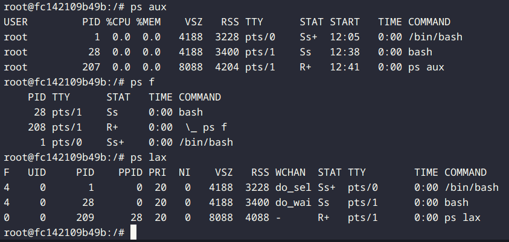
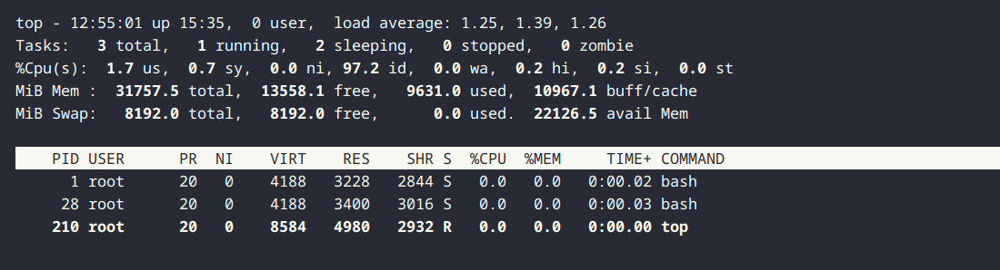
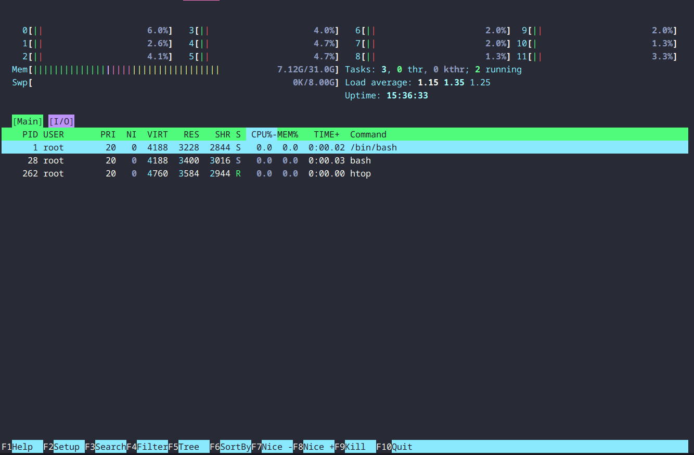
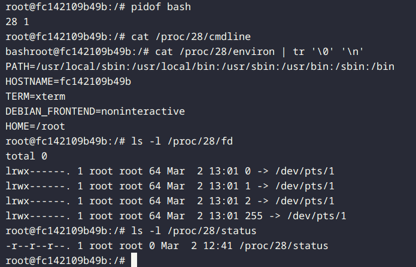
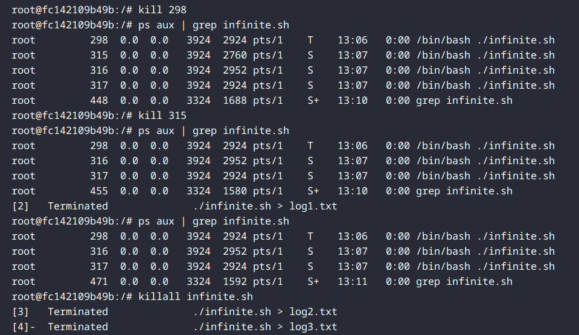
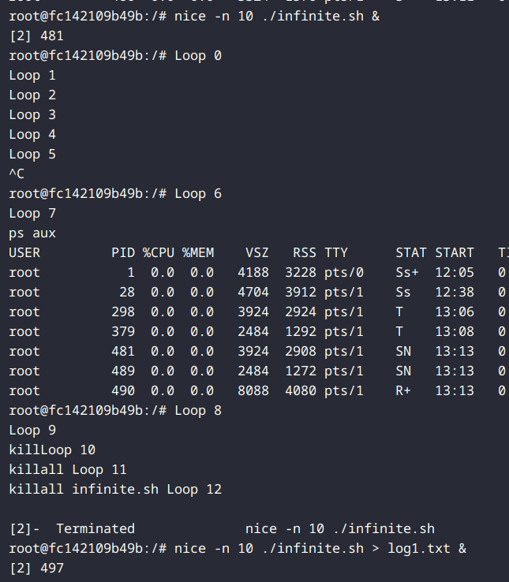

# Process Control di UNIX/Linux

## Daftar Isi
- [Pendahuluan](#pendahuluan)
- [Persiapan Lab](#persiapan-lab)
- [Memonitor Proses](#memonitor-proses)
- [Mengelola Proses](#mengelola-proses)
- [Prioritas Proses](#prioritas-proses)
- [Menggunakan Sinyal](#menggunakan-sinyal)
- [Menjadwalkan Proses dengan cron](#menjadwalkan-proses-dengan-cron)
- [Debugging Proses dengan strace](#debugging-proses-dengan-strace)

## Pendahuluan

Komponen dari Sebuah Proses

Sebuah proses terdiri dari address space dan serangkaian struktur data di dalam kernel. address space adalah sekumpulan halaman memori yang telah ditandai oleh kernel untuk digunakan oleh proses tersebut. (Halaman adalah unit di mana memori dikelola. Biasanya berukuran 4KiB atau 8KiB.) Halaman-halaman ini digunakan untuk menyimpan kode, data, dan stack dari proses. Struktur data di dalam kernel melacak status proses, prioritasnya, parameter penjadwalannya, dan sebagainya.

Proses seperti wadah untuk sekumpulan sumber daya yang dikelola oleh kernel atas nama program yang sedang berjalan. Sumber daya ini termasuk halaman memori yang menyimpan kode dan data program, deskriptor file yang merujuk ke file yang terbuka, dan berbagai atribut yang menggambarkan status proses.

Struktur data internal kernel mencatat berbagai informasi tentang setiap proses:

- Peta proses address space
- Status saat ini dari proses (berjalan, tidur, dan sebagainya)
- Prioritas proses
- Informasi tentang sumber daya yang telah digunakan oleh proses (CPU, memori, dan sebagainya)
- Informasi tentang file dan port jaringan yang telah dibuka oleh proses
- Masker sinyal proses (set sinyal yang saat ini diblokir)
- Pemilik proses (ID pengguna dari pengguna yang memulai proses)

Sebuah "thread" adalah konteks eksekusi di dalam sebuah proses. Sebuah proses dapat memiliki beberapa thread, yang semuanya berbagi address space dan sumber daya lainnya. Thread digunakan untuk mencapai paralelisme di dalam sebuah proses. Thread juga dikenal sebagai proses ringan karena jauh lebih murah untuk dibuat dan dihancurkan dibandingkan dengan proses.

Sebagai contoh untuk memahami konsep proses dan thread, pertimbangkan sebuah server web. Server web mendengarkan koneksi yang masuk dan kemudian membuat thread baru untuk menangani setiap permintaan yang masuk. Setiap thread menangani satu permintaan pada satu waktu, tetapi server web secara keseluruhan dapat menangani banyak permintaan secara bersamaan karena memiliki banyak thread. Di sini, server web adalah sebuah proses, dan setiap thread adalah konteks eksekusi terpisah di dalam proses tersebut.

## Memulai Lab

### Struktur Direktori

```
/AdminJaringan2025/
├── ...
├── Tugas2 : Process Control/
├── ....
├── unix-and-linux-sysadmin-notes/
│   ├── process-control/
│   │    ├── data/
│   │    └── training/
│   └── docker-compose.yml
└── ....
```

1. Masuk ke direktori `/unix-and-linux-sysadmin-notes/`
2. Jalankan perintah berikut untuk memulai environment lab:
   ```bash
   docker-compose up -d --build
   ```
3. Pastikan container dan network sudah berhasil dibuat:
    
    
3. masuk ke container lab:

untuk percobaan ini kita akan menggunakan lab-debian/

   ```bash
   docker exec -it lab-debian bash
   ```

## Konsep Dasar Process Control

### Anatomi Proses

Proses di Unix/Linux memiliki beberapa karakteristik penting:

- **PID (Process ID)**: Pengenal unik untuk setiap proses
- **PPID (Parent Process ID)**: ID dari proses induk yang membuat proses tersebut
- **UID dan GID**: User ID dan Group ID yang menjalankan proses
- **Prioritas dan jadwal eksekusi**: Menentukan kapan dan seberapa sering proses mendapat jatah CPU
- **Working directory**: Direktori kerja dari proses
- **Environment variables**: Variabel lingkungan yang tersedia untuk proses
- **Handlers**: Rutinitas untuk menangani berbagai sinyal
- **File descriptor**: Pointer ke file, socket, dan resources lain

### Siklus Hidup Proses

1. **Pembuatan Proses**:
   - Proses dibuat melalui system call `fork()` yang membuat duplikat (child) dari proses yang memanggilnya (parent)
   - Child process biasanya melanjutkan dengan system call `exec()` untuk mengganti program yang dieksekusi

2. **Eksekusi**:
   - Proses aktif berjalan di CPU
   - Dijadwalkan oleh kernel berdasarkan prioritas dan algoritma penjadwalan

3. **Terminasi**:
   - Proses dapat berakhir normal dengan system call `exit()`
   - Proses dapat dihentikan paksa dengan sinyal seperti SIGKILL

### Status Proses

Proses dapat berada dalam beberapa status:
- **Running**: Proses aktif berjalan
- **Sleeping**: Proses menunggu input/output atau sumber daya lain
- **Stopped**: Proses dihentikan sementara (misalnya dengan SIGSTOP)
- **Zombie**: Proses yang telah selesai tapi masih memiliki entry di tabel proses

### Sinyal (Signals)

Sinyal adalah cara untuk mengirim notifikasi ke sebuah proses. Mereka digunakan untuk memberitahu proses bahwa suatu kejadian tertentu telah terjadi.

Ada sekitar tiga puluh jenis sinyal yang didefinisikan, dan mereka digunakan dalam berbagai cara:

- Mereka dapat dikirim antar proses sebagai sarana komunikasi.
- Mereka dapat dikirim oleh driver terminal untuk menghentikan, menginterupsi, atau menangguhkan proses ketika tombol seperti Ctrl+C dan Ctrl+Z ditekan.
- Mereka dapat dikirim oleh administrator (dengan perintah kill) untuk mencapai berbagai tujuan.
- Mereka dapat dikirim oleh kernel ketika sebuah proses melakukan pelanggaran seperti pembagian dengan nol.
- Mereka dapat dikirim oleh kernel untuk memberitahu proses tentang kondisi "menarik" seperti kematian proses anak atau ketersediaan data pada saluran I/O.


Sinyal KILL, INT, TERM, HUP, dan QUIT semuanya terdengar seolah-olah mereka berarti hal yang hampir sama, tetapi penggunaannya sebenarnya sangat berbeda.

- **KILL** tidak dapat diblokir dan menghentikan proses di tingkat kernel. Sebuah proses tidak pernah benar-benar menerima atau menangani sinyal ini.
- **INT** dikirim oleh driver terminal ketika pengguna mengetik Ctrl+C. Ini adalah permintaan untuk menghentikan operasi saat ini. Program sederhana harus berhenti (jika mereka menangkap sinyal) atau membiarkan diri mereka dihentikan, yang merupakan default jika sinyal tidak ditangkap. Program yang memiliki baris perintah interaktif (seperti shell) harus menghentikan apa yang mereka lakukan, membersihkan, dan menunggu input pengguna lagi.
- **TERM** adalah permintaan untuk menghentikan eksekusi sepenuhnya. Diharapkan bahwa proses yang menerima akan membersihkan statusnya dan keluar.
- **HUP** dikirim ke proses ketika terminal pengendali ditutup. Awalnya digunakan untuk menunjukkan "hang up" dari koneksi telepon, sekarang sering digunakan untuk menginstruksikan proses daemon untuk menghentikan dan memulai ulang, sering kali untuk memperhitungkan konfigurasi baru. Perilaku tepatnya tergantung pada proses spesifik yang menerima sinyal HUP.
- **QUIT** mirip dengan TERM, kecuali bahwa ia secara default menghasilkan core dump jika tidak ditangkap. Beberapa program menggunakan sinyal ini dan menafsirkannya untuk berarti sesuatu yang lain.

Sinyal-sinyal ini memungkinkan administrator sistem dan program untuk mengelola proses dengan cara yang fleksibel dan efektif. Misalnya, daemon server dapat mereload konfigurasi tanpa downtime menggunakan HUP, atau proses yang tidak merespons dapat dihentikan secara paksa menggunakan KILL.

## Memonitor Proses

### 1.1. Menggunakan ps

1. Jalankan perintah berikut untuk melihat semua proses yang sedang berjalan:
   ```bash
   ps aux
   ```

2. Gunakan perintah berikut untuk melihat struktur hierarki proses:
   ```bash
   ps f
   ```

3. Gunakan `ps lax` untuk melihat informasi teknis lebih lanjut tentang proses:
   ```bash
   ps lax
   ```

    

Amati kolom output dan catat informasi yang ditampilkan:
   - USER: pemilik proses
   - PID: ID proses
   - %CPU: persentase CPU yang digunakan
   - %MEM: persentase memori yang digunakan
   - VSZ: ukuran virtual memori
   - RSS: ukuran memori fisik yang digunakan
   - TTY: terminal yang terkait dengan proses
   - STAT: status proses
   - START: waktu proses dimulai
   - TIME: waktu CPU yang digunakan
   - COMMAND: perintah yang dijalankan


### 1.2. Menggunakan top dan htop

1. Jalankan `top` untuk melihat proses secara real-time:
   ```bash
   top
   ```
   

2. Pelajari kontrol interaktif di top:
   - `q`: keluar dari top
   - `h`: menampilkan bantuan
   - `k`: mengirim sinyal ke proses
   - `r`: mengubah prioritas proses
   - `F`: konfigurasikan kolom yang ditampilkan
   - `<`: sortir berdasarkan kolom sebelumnya
   - `>`: sortir berdasarkan kolom berikutnya

3. Jika tersedia, coba gunakan htop untuk tampilan yang lebih interaktif:
   ```bash
   htop
   ```
   (Jika tidak tersedia, instal dengan `apt-get install htop`)

   


### 1.3. Memeriksa /proc Filesystem

1. Lihat informasi tentang CPU dari /proc:
   ```bash
   cat /proc/cpuinfo
   ```

2. Periksa informasi memori:
   ```bash
   cat /proc/meminfo
   ```

3. Pilih sebuah proses (misalnya bash) dan periksa informasinya:
   ```bash
   # Temukan PID dari bash
   pidof bash
   
   # Ganti PID dengan nilai yang sebenarnya
   PID=$(pidof bash | awk '{print $1}')
   
   # Lihat command line proses
   cat /proc/$PID/cmdline
   
   # Lihat environment variables
   cat /proc/$PID/environ | tr '\0' '\n'
   
   # Lihat status proses
   cat /proc/$PID/status
   
   # Lihat file descriptor yang dibuka
   ls -l /proc/$PID/fd
   ```
   

## Mengelola Proses

### 2.1. Membuat Proses Background

1. Buat script sederhana yang berjalan lama:
   ```bash
   cat > infinite.sh << 'EOL'
   #!/bin/bash
   count=0
   while true; do
       echo "Loop $count"
       count=$((count+1))
       sleep 5
   done
   EOL
   
   chmod +x infinite.sh
   ```

2. Jalankan script di background:
   ```bash
   ./infinite.sh &
   ```

3. Lihat proses yang berjalan di background:
   ```bash
   jobs
   ```

4. Bawa proses ke foreground:
   ```bash
   fg %1
   ```

5. Tekan Ctrl+Z untuk menghentikan sementara, kemudian kirim kembali ke background:
   ```bash
   bg %1
   ```

### 2.2. Menggunakan kill, killall, dan pkill

1. Buat beberapa proses background:
   ```bash
   ./infinite.sh > log1.txt &
   ./infinite.sh > log2.txt &
   ./infinite.sh > log3.txt &
   ```

2. Identifikasi PID dari proses:
   ```bash
   ps aux | grep infinite.sh
   ```

3. Hentikan salah satu proses dengan kill:
   ```bash
   # Ganti PID dengan nilai sebenarnya dari output ps
   kill PID
   ```

4. Hentikan semua proses infinite.sh dengan killall:
   ```bash
   killall infinite.sh
   ```

5. Mulai ulang beberapa proses, kemudian gunakan pkill:
   ```bash
   ./infinite.sh > log1.txt &
   ./infinite.sh > log2.txt &
   
   # Hentikan semua proses dengan nama tertentu
   pkill -f infinite.sh
   ```


### 2.3. Menemukan PID Proses

1. Gunakan pgrep untuk menemukan PID berdasarkan nama:
   ```bash
   ./infinite.sh > logfile.txt &
   pgrep -f infinite.sh
   ```

2. Gunakan pidof untuk menemukan PID berdasarkan path:
   ```bash
   pidof bash
   ```

## Prioritas Proses

### 3.1. Memahami nice dan renice

1. Jalankan proses dengan prioritas nice rendah (nilai tinggi):
   ```bash
   nice -n 10 ./infinite.sh &
   ```
   

2. Jalankan proses dengan prioritas nice tinggi (nilai rendah):
   ```bash
   nice -n -10 ./infinite.sh &
   ```

3. Periksa nilai nice dari proses:
   ```bash
   ps -o pid,ppid,ni,cmd -p $(pgrep -f infinite.sh)
   ```

4. Ubah prioritas proses yang sudah berjalan:
   ```bash
   # Temukan PID
   PID=$(pgrep -f infinite.sh | head -1)
   
   # Ubah nice value (sebagai root)
   sudo renice -n 15 -p $PID
   
   # Verifikasi perubahan
   ps -o pid,ppid,ni,cmd -p $PID
   ```

### 3.2. Melihat Dampak Prioritas

1. Buat script CPU-intensif:
   ```bash
   cat > cpu_intensive.sh << 'EOL'
   #!/bin/bash
   end=$((SECONDS+60))
   while [ $SECONDS -lt $end ]; do
       for i in {1..1000000}; do
           echo "Scale=5000; 4*a(1)" | bc -l > /dev/null
       done
   done
   echo "Done"
   EOL
   
   chmod +x cpu_intensive.sh
   ```

2. Jalankan dua instance dengan prioritas berbeda:
   ```bash
   time nice -n 19 ./cpu_intensive.sh &
   time nice -n 0 ./cpu_intensive.sh &
   ```

3. Monitor dengan top dan perhatikan penggunaan CPU.

## Praktikum 4: Menggunakan Sinyal

### 4.1. Mempelajari Sinyal

1. Lihat daftar semua sinyal:
   ```bash
   kill -l
   ```

2. Buat script yang menangani sinyal:
   ```bash
   cat > signal_handler.sh << 'EOL'
   #!/bin/bash
   
   echo "PID: $$"
   
   trap 'echo "Received SIGHUP (1)"' SIGHUP
   trap 'echo "Received SIGINT (2)"; exit' SIGINT
   trap 'echo "Received SIGTERM (15)"' SIGTERM
   trap 'echo "Received SIGUSR1 (10)"' SIGUSR1
   
   echo "Script running. Send signals with:"
   echo "kill -HUP $$ (Hang up)"
   echo "kill -INT $$ or Ctrl+C (Interrupt)"
   echo "kill -TERM $$ (Terminate)"
   echo "kill -USR1 $$ (User defined 1)"
   
   while true; do
       sleep 2
       echo "."
   done
   EOL
   
   chmod +x signal_handler.sh
   ```

3. Jalankan script:
   ```bash
   ./signal_handler.sh
   ```

4. Dari terminal lain, kirim sinyal ke proses:
   ```bash
   # Ganti PID dengan nilai yang ditampilkan oleh script
   kill -HUP PID
   kill -USR1 PID
   kill -TERM PID
   ```

5. Kembali ke terminal pertama dan tekan Ctrl+C untuk mengirim SIGINT.

### 4.2. Membuat Zombie Process

1. Buat script yang menghasilkan zombie process:
   ```bash
   cat > zombie.sh << 'EOL'
   #!/bin/bash
   
   # Parent process
   echo "Parent PID: $$"
   
   # Create child process
   for i in {1..3}; do
       bash -c "echo Child process $i with PID: \$\$; sleep 1; exit" &
   done
   
   echo "Parent sleeping and not waiting for children..."
   sleep 30
   echo "Parent exiting"
   EOL
   
   chmod +x zombie.sh
   ```

2. Jalankan script:
   ```bash
   ./zombie.sh &
   ```

3. Periksa status zombie:
   ```bash
   ps aux | grep defunct
   ```

## Menjadwalkan Proses dengan cron

### 5.1. Membuat Crontab

1. Edit crontab untuk pengguna saat ini:
   ```bash
   crontab -e
   ```

2. Tambahkan entri untuk menjalankan script setiap menit:
   ```
   # Run script every minute
   * * * * * echo "Cron executed at $(date)" >> /tmp/cron_log.txt
   ```

3. Simpan dan keluar dari editor.

4. Verifikasi crontab:
   ```bash
   crontab -l
   ```

5. Tunggu beberapa menit dan periksa hasilnya:
   ```bash
   cat /tmp/cron_log.txt
   ```

### 5.2. Format Crontab Lanjutan

1. Edit crontab lagi:
   ```bash
   crontab -e
   ```

2. Tambahkan beberapa entri dengan format yang berbeda:
   ```
   # Format: minute hour day month day_of_week command
   
   # Run at 2:30 AM every day
   30 2 * * * echo "2:30 AM task" >> /tmp/cron_schedule.txt
   
   # Run every 5 minutes
   */5 * * * * echo "Every 5 minutes" >> /tmp/cron_schedule.txt
   
   # Run at 10:30 PM on weekdays (Monday-Friday)
   30 22 * * 1-5 echo "Weekday night" >> /tmp/cron_schedule.txt
   
   # Run on the 1st of every month at 5:00 AM
   0 5 1 * * echo "Monthly task" >> /tmp/cron_schedule.txt
   ```

3. Simpan dan keluar dari editor.

## Debugging Proses dengan strace

### 6.1. Menggunakan strace

1. Instal strace jika belum tersedia:
   ```bash
   apt-get update && apt-get install -y strace
   ```

2. Buat script sederhana:
   ```bash
   cat > hello.sh << 'EOL'
   #!/bin/bash
   echo "Hello, world!"
   cat /etc/hostname
   sleep 2
   date
   EOL
   
   chmod +x hello.sh
   ```

3. Trace system calls:
   ```bash
   strace ./hello.sh
   ```

4. Trace hanya system calls tertentu:
   ```bash
   strace -e open,read,write ./hello.sh
   ```

5. Trace process yang sudah berjalan:
   ```bash
   # Jalankan di background
   ./infinite.sh &
   
   # Ambil PID
   PID=$(pgrep -f infinite.sh)
   
   # Trace
   strace -p $PID
   ```

### 6.2. Menganalisis Output strace

1. Simpan output strace ke file:
   ```bash
   strace -o trace.log ./hello.sh
   ```

2. Analisis statistik system calls:
   ```bash
   strace -c ./hello.sh
   ```

3. Periksa file descriptor yang dibuka:
   ```bash
   strace -e open,openat ./hello.sh
   ```
