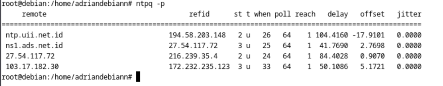

# **Tugas Instalasi dan Konfigurasi Layanan pada Debian 12**

## **Spesifikasi Virtual Machine (VM)**
Untuk memastikan performa optimal selama instalasi dan konfigurasi layanan, gunakan spesifikasi berikut untuk VM Debian 12:
- **CPU**: 4 Core
- **RAM**: 2 GB
- **Storage**: 20 GB

---

## **Konfigurasi Mirror Debian**
Agar proses instalasi paket lebih cepat dan stabil, gunakan mirror lokal dari PENS. Tambahkan baris berikut ke dalam file `/etc/apt/sources.list`:

```plaintext
deb https://kebo.pens.ac.id/debian/ bookworm main contrib non-free
deb https://kebo.pens.ac.id/debian/ bookworm-updates main contrib non-free
deb https://kebo.pens.ac.id/debian-security/ bookworm/updates main contrib non-free
```

### **Langkah-langkah Mengubah Mirror**
1. Buka file `sources.list` menggunakan editor teks:
   ```bash
   nano /etc/apt/sources.list
   ```
2. Ganti isi file dengan konfigurasi mirror di atas.
3. Simpan perubahan dan keluar dari editor.
4. Perbarui repositori paket:
   ```bash
   apt update && apt upgrade -y
   ```


---

## **A. Instalasi dan Konfigurasi NTP Client**
Agar host memiliki waktu yang sinkron dengan server NTP di Indonesia, lakukan langkah-langkah berikut.

### **1. Instalasi NTP Client**
1. **Perbarui repositori paket**
   ```bash
   apt update && apt upgrade -y
   ```
2. **Instal paket NTP yang diperlukan**
   ```bash
   apt install ntp ntpsec -y
   ```


masih menggunakan debian.pool.ntp.org

### **2. Konfigurasi NTP Client**
1. **Edit file konfigurasi NTP**
   ```bash
   nano /etc/ntp.conf
   ```
2. **Tambahkan atau sesuaikan baris berikut untuk menggunakan server NTP Indonesia:**
   ```plaintext
   server 0.id.pool.ntp.org
   server 1.id.pool.ntp.org
   server 2.id.pool.ntp.org
   server 3.id.pool.ntp.org
   ```
3. **Simpan perubahan dan keluar dari editor.**
4. **Restart layanan NTP untuk menerapkan konfigurasi**
   ```bash
   systemctl restart ntp
   ```
5. **Pastikan layanan NTP berjalan**
   ```bash
   systemctl status ntp
   ```

6. Gunakan perintah berikut untuk memverifikasi sinkronisasi waktu:
   ```bash
   ntpq -p
   ```




---

## **B. Instalasi dan Konfigurasi Samba**

### **1. Instalasi Samba**
1. **Perbarui repositori dan instal paket Samba**
   ```bash
   apt update && apt install samba smbclient cifs-utils -y
   ```

*(Tempat untuk screenshot instalasi paket Samba)*

2. **Pastikan layanan berjalan**
   ```bash
   systemctl status smbd
   ```


---

### **2. Konfigurasi Public Shared Folder**
1. **Buat direktori untuk shared folder**
   ```bash
   mkdir -p /srv/samba/public
   ```
2. **Atur izin akses**
   ```bash
   chmod 777 /srv/samba/public
   ```
3. **Edit konfigurasi Samba**
   ```bash
   nano /etc/samba/smb.conf
   ```
   Tambahkan konfigurasi berikut:
   ```plaintext
   [Public]
   path = /srv/samba/public
   browsable = yes
   writable = yes
   guest ok = yes
   read only = no
   ```
4. **Restart layanan Samba**
   ```bash
   systemctl restart smbd
   ```

5. **Uji akses dari Fedora Host(OS laptop saya) melalui CLI:**
   ```bash
   smbclient -L //server-ip -U username
   ```
*(Tempat untuk screenshot akses Dolphin ke Public Shared Folder)*

6. **Uji akses dari Fedora Host(OS laptop saya) melalui Dolphin:**
   - Buka Dolphin File Manager.
   - Klik **Network** > **Samba Shares**.
   - Masukkan alamat: `smb://server-ip/Public`.
   - Pastikan bisa mengakses folder tanpa autentikasi.

*(Tempat untuk screenshot akses Dolphin ke Public Shared Folder)*

---

### **3. Konfigurasi Limited Shared Folder**
### Persiapan Network

#### Pengecekan Konektivitas Jaringan antara VM dan Host

Sebelum mengkonfigurasi Samba, pastikan VM dan host dapat saling berkomunikasi melalui jaringan. Lakukan pengecekan konektivitas dengan:

1. **Dari VM ke Host:**
```bash
ping <ip-address-host>
```

2. **Dari Host ke VM:**
```bash
ping <ip-address-vm>
```

#### Jenis-jenis Network Adaptor VM

Penting untuk memahami perbedaan tipe jaringan VM untuk Samba server:

1. **NAT (Network Address Translation)**
   - VM dapat mengakses jaringan eksternal melalui IP host
   - Host dapat berkomunikasi dengan VM, tetapi perangkat lain di jaringan tidak bisa langsung mengakses VM
   - Tidak ideal untuk Samba server karena perangkat lain tidak bisa mengakses layanan

2. **Bridge Network**
   - VM mendapatkan IP dari DHCP yang sama dengan jaringan host (seolah-olah perangkat fisik terpisah)
   - Semua perangkat di jaringan dapat langsung berkomunikasi dengan VM
   - **Direkomendasikan untuk server Samba** karena memungkinkan semua perangkat di jaringan mengakses share

3. **Macvlan**
   - Mirip dengan bridge network tetapi membuat antarmuka virtual dengan MAC address terpisah
   - VM terlihat seperti perangkat fisik terpisah di jaringan
   - Dapat digunakan untuk Samba tetapi konfigurasinya lebih kompleks

#### Mengkonfigurasi Bridged Network pada VM

1. **Cek konfigurasi network saat ini:**
```bash
ip addr show
```

2. **Konfirmasi VM menggunakan Bridged Network:**
```bash
# Jika menggunakan NetworkManager
nmcli connection show

# Jika menggunakan netplan (Ubuntu)
cat /etc/netplan/*.yaml
```

3. **Pastikan VM dan Host terhubung ke jaringan yang sama:**
```bash
# Di VM
ip route
# Di Host
ip route
```

4. **Uji konektivitas:**
```bash
# Dari VM ke Host
ping <host-ip>
# Dari Host ke VM
ping <vm-ip>
```

1. **Buat direktori untuk limited shared folder**
   ```bash
   mkdir -p /srv/samba/limited
   ```
2. **Buat grup khusus untuk akses terbatas**
   ```bash
   groupadd sambashare
   ```
3. **Tambahkan pengguna ke grup**
   ```bash
   usermod -aG sambashare $USER
   ```
4. **Atur izin dan kepemilikan direktori**
   ```bash
   chown -R root:sambashare /srv/samba/limited
   chmod 770 /srv/samba/limited
   ```
5. **Edit konfigurasi Samba**
   ```bash
   nano /etc/samba/smb.conf
   ```
   Tambahkan:
   ```plaintext
   [Limited]
   path = /srv/samba/limited
   browsable = yes
   writable = yes
   valid users = @sambashare
   read only = no
   ```
6. **Setel password Samba untuk pengguna**
   ```bash
   smbpasswd -a $USER
   ```
7. **Restart layanan Samba**
   ```bash
   systemctl restart smbd
   ```

8. **Uji akses dari Fedora Host(OS laptop saya) melalui CLI:**
   ```bash
   smbclient -L //server-ip -U username
   ```

*(Tempat untuk screenshot hasil akses CLI ke Limited Shared Folder)*

9. **Uji akses dari Fedora Host(OS laptop saya) melalui Dolphin:**
   - Buka Dolphin File Manager.
   - Klik **Network** > **Samba Shares**.
   - Masukkan alamat: `smb://server-ip/Limited`.
   - Masukkan username dan password.
   - Pastikan bisa mengakses folder dengan autentikasi.

*(Tempat untuk screenshot akses Dolphin ke Limited Shared Folder)*

---

## **C. Rangkuman tentang Package Management di Debian 12**

Berikut adalah rangkuman yang lebih panjang dan mendetail dari dokumen **The Beginner's Handbook: Debian 12 System Administration** yang membahas tentang administrasi sistem pada Debian 12:

---

### **1. Sumber Perangkat Lunak (Software Sources)**
Debian GNU/Linux menggunakan sistem repositori untuk mendistribusikan aplikasi. Repositori ini memungkinkan sentralisasi perangkat lunak dan memudahkan administrasi serta pembaruan sistem. Alamat internet dari repositori Debian disimpan dalam file `/etc/apt/sources.list` dan file-file di direktori `/etc/apt/sources.list.d/`.

- **Mengedit `sources.list`**:
  - File ini dapat diedit menggunakan perintah seperti `apt edit-sources` atau editor teks seperti `nano` atau `vim`.
  - Contoh isi file `sources.list` pada Debian 12 (Bookworm):
    ```plaintext
    deb http://deb.debian.org/debian/ bookworm main non-free-firmware
    deb-src http://deb.debian.org/debian/ bookworm main non-free-firmware
    deb http://security.debian.org/debian-security bookworm-security main non-free-firmware
    deb-src http://security.debian.org/debian-security bookworm-security main non-free-firmware
    deb http://deb.debian.org/debian/ bookworm-updates main non-free-firmware
    deb-src http://deb.debian.org/debian/ bookworm-updates main non-free-firmware
    ```
  - Baris yang diawali dengan `#` adalah komentar dan tidak dieksekusi.

- **Menambahkan Repositori**:
  - Untuk paket gratis: `deb http://deb.debian.org/debian/ bookworm main`
  - Untuk paket gratis dan proprietary: `deb http://deb.debian.org/debian/ bookworm main contrib non-free non-free-firmware`

---

### **2. APT (Advanced Package Tool)**
APT adalah alat utama untuk mengelola paket di Debian melalui terminal. APT memungkinkan pengguna untuk menginstal, memperbarui, dan menghapus paket dengan mudah.

#### **Perintah Dasar APT**:
- **Perintah Pengguna** (tanpa hak admin):
  - `apt show foo`: Menampilkan informasi detail tentang paket `foo`.
  - `apt search foo`: Mencari paket yang sesuai dengan kata kunci `foo`.
  - `apt-cache policy foo`: Menampilkan versi yang tersedia dari paket `foo`.

- **Perintah Administrator** (dengan hak root):
  - `apt update`: Memperbarui metadata repositori (daftar paket yang tersedia).
  - `apt install foo`: Menginstal paket `foo` beserta dependensinya.
  - `apt upgrade`: Memperbarui paket yang sudah terinstal ke versi terbaru.
  - `apt full-upgrade`: Memperbarui paket dengan menambah/menghapus paket lain jika diperlukan.
  - `apt remove foo`: Menghapus paket `foo`, tetapi tidak menghapus file konfigurasinya.
  - `apt purge foo`: Menghapus paket `foo` beserta file konfigurasinya.
  - `apt autoremove`: Menghapus paket yang tidak diperlukan lagi.
  - `apt clean`: Membersihkan cache paket yang terinstal.
  - `apt autoclean`: Membersihkan cache paket yang sudah usang.

- **Perintah Gabungan**:
  - Untuk memperbarui sistem sekaligus membersihkan cache:
    ```bash
    apt update && apt full-upgrade && apt autoclean
    ```
  - Untuk menghapus paket yang tidak diperlukan beserta file konfigurasinya:
    ```bash
    apt autoremove --purge
    ```

---

### **3. Manajer Paket Grafis**
Debian menyediakan beberapa antarmuka grafis untuk mengelola paket, yang memudahkan pengguna yang tidak terbiasa dengan terminal.

#### **Software (Gnome Software)**:
- **Pencarian Aplikasi**: Bisa dilakukan melalui kategori atau langsung dengan nama aplikasi.
- **Instalasi Aplikasi**: Klik tombol "Install" dan masukkan password administrator.
- **Pembaruan Sistem**: Dapat dilakukan melalui bagian "Updates".
- **Modifikasi Repositori**: Bisa dilakukan melalui menu "Repositories".
- **Pembaruan Otomatis**: Dapat diaktifkan melalui menu "Update Preferences".

#### **Discover (KDE Discover)**:
- **Pencarian dan Instalasi**: Bisa dilakukan melalui kategori atau langsung dengan nama aplikasi.
- **Pembaruan Sistem**: Dapat dilakukan melalui bagian "Updates".
- **Modifikasi Repositori**: Bisa dilakukan melalui menu "Settings".
- **Instalasi Widget dan Addons Plasma**: Discover juga memungkinkan instalasi widget dan addons untuk lingkungan desktop Plasma.

#### **Synaptic Package Manager**:
- **Pencarian Paket**: Bisa dilakukan melalui nama paket atau kategori.
- **Instalasi dan Penghapusan Paket**: Bisa dilakukan dengan menandai paket untuk instalasi atau penghapusan.
- **Pembaruan Sistem**: Perlu memuat ulang daftar paket sebelum melakukan pembaruan.
- **Pembersihan Paket yang Tidak Terpakai**: Synaptic dapat membersihkan paket yang tidak diperlukan lagi (auto removable packages) dan file konfigurasi yang tersisa.

---

### **4. Pembersihan Sistem**
Debian menyediakan beberapa alat untuk membersihkan sistem dan mengoptimalkan ruang disk.

#### **Membersihkan Cache Paket**:
- `apt clean`: Membersihkan cache paket yang terinstal.
- `apt autoclean`: Membersihkan cache paket yang sudah usang.
- `apt autoremove --purge`: Menghapus paket yang tidak diperlukan beserta file konfigurasinya.

#### **Membersihkan Sampah (Trash)**:
- Sampah pengguna: `rm -Rf ~/.local/share/Trash/*`
- Sampah administrator: `rm -Rf /root/.local/share/Trash/*`
- Sampah di disk eksternal: Biasanya terletak di `/media/your_id/your_disk/.Trash_1000`.

#### **Membersihkan Cache Aplikasi**:
- `rm -Rf ~/.cache/*`: Membersihkan cache aplikasi yang disimpan di direktori `.cache`.

#### **Membersihkan Thumbnail**:
- `rm -Rf ~/.thumbnails`: Membersihkan thumbnail yang sudah tidak digunakan.

---

### **5. Instalasi Paket Eksternal**
Debian mendukung instalasi paket eksternal dalam format `.deb`.

#### **GDebi**:
- Alat grafis untuk menginstal paket `.deb` sambil mengelola dependensi.
- Untuk menginstal GDebi:
  ```bash
  apt update && apt install gdebi
  ```
- Setelah mengunduh paket `.deb`, klik kanan dan pilih "Open with gdebi" untuk menginstalnya.

#### **Dpkg**:
- Alat terminal untuk menginstal paket `.deb` tanpa mengelola dependensi.
- Perintah dasar:
  - Instalasi: `dpkg -i package_name.deb`
  - Jika ada dependensi yang hilang, instal secara manual dengan `apt install dependency_1 dependency_2 ...`
  - Penghapusan: `dpkg --purge package_name`

---

### **6. Instalasi Aplikasi Flatpak**
Flatpak adalah sistem virtualisasi aplikasi yang memungkinkan instalasi aplikasi dalam lingkungan terisolasi (sandbox).

#### **Instalasi Flatpak**:
- Instalasi paket Flatpak:
  ```bash
  apt install flatpak
  ```
- Menambahkan repositori Flatpak (contoh: Flathub):
  ```bash
  flatpak remote-add flathub https://flathub.org/repo/flathub.flatpakrepo
  ```

#### **Manajemen Flatpak**:
- **Gnome**: Menggunakan plugin `gnome-software-plugin-flatpak`.
- **KDE**: Menggunakan plugin `plasma-discover-backend-flatpak`.
- **Terminal**: Perintah seperti `flatpak install`, `flatpak uninstall`, dan `flatpak update`.

#### **Contoh Instalasi Flatpak**:
- Instalasi LibreOffice dari Flathub:
  ```bash
  flatpak install flathub org.libreoffice.LibreOffice
  ```
- Menjalankan aplikasi Flatpak:
  ```bash
  flatpak run org.libreoffice.LibreOffice
  ```

---

### **7. Cabang Distribusi Debian**
Debian memiliki beberapa cabang distribusi yang berjalan secara paralel:

- **Stable**: Versi resmi Debian yang direkomendasikan untuk penggunaan sehari-hari.
- **Oldstable**: Versi stabil sebelumnya, biasanya didukung selama satu tahun setelah rilis versi stabil baru.
- **Testing**: Versi yang sedang dipersiapkan untuk menjadi versi stabil berikutnya.
- **Unstable (Sid)**: Versi yang menerima pembaruan terbaru, tetapi kurang stabil.
- **Experimental**: Repositori untuk menguji versi alpha atau beta perangkat lunak.

---

### **8. Analisis Ruang Disk**
Debian menyediakan alat untuk menganalisis penggunaan ruang disk.

#### **Ncdu**:
- Alat analisis ruang disk dalam mode terminal.
- Untuk menginstal:
  ```bash
  apt update && apt install ncdu
  ```
- Untuk menjalankan:
  ```bash
  ncdu
  ```

#### **Baobab**:
- Alat analisis ruang disk dalam mode grafis.
- Untuk menginstal:
  ```bash
  apt update && apt install baobab
  ```

---

### **9. Penghapusan Paket yang Tidak Terpakai**
Debian menyediakan alat untuk mendeteksi dan menghapus paket yang tidak terpakai (orphaned packages).

#### **Deborphan**:
- Untuk menginstal:
  ```bash
  apt install deborphan
  ```
- Untuk menampilkan daftar paket yang tidak terpakai:
  ```bash
  echo $(deborphan)
  ```
- Untuk menghapus paket yang tidak terpakai:
  ```bash
  apt autoremove --purge $(deborphan)
  ```

---

### **10. Pembersihan File Konfigurasi yang Tersisa**
File konfigurasi yang tersisa setelah penghapusan paket dapat dibersihkan dengan perintah berikut:
- Menampilkan file konfigurasi yang tersisa:
  ```bash
  dpkg --list | awk '/^rc/ {print $2}'
  ```
- Menghapus file konfigurasi yang tersisa:
  ```bash
  apt purge $(dpkg --list | awk '/^rc/ {print $2}')
  ```

---

### **11. Penggunaan NALA sebagai Pengganti APT di Debian 12**
NALA adalah antarmuka frontend untuk APT yang menawarkan pengalaman pengguna yang lebih baik dengan fitur-fitur tambahan seperti tampilan yang lebih bersih dan manajemen dependensi yang lebih baik. Untuk informasi lebih lanjut tentang penggunaan NALA sebagai pengganti APT di Debian 12, silakan lihat [file ini](./nala%20(apt%20frontend).md).

### **Referensi**
- Materi [**Ethol Debian 12 SysAdmin**](asset/handbook.pdf)
- [Penggunaan NALA sebagai Pengganti APT di Debian 12](./nala%20(apt%20frontend).md)

---


Ini memberikan panduan lengkap untuk administrasi sistem Debian 12, mulai dari manajemen paket, pembaruan sistem, hingga pembersihan dan optimasi ruang disk. Dengan mengikuti panduan ini, pengguna dapat dengan mudah mengelola sistem Debian mereka, baik melalui terminal maupun antarmuka grafis.


---