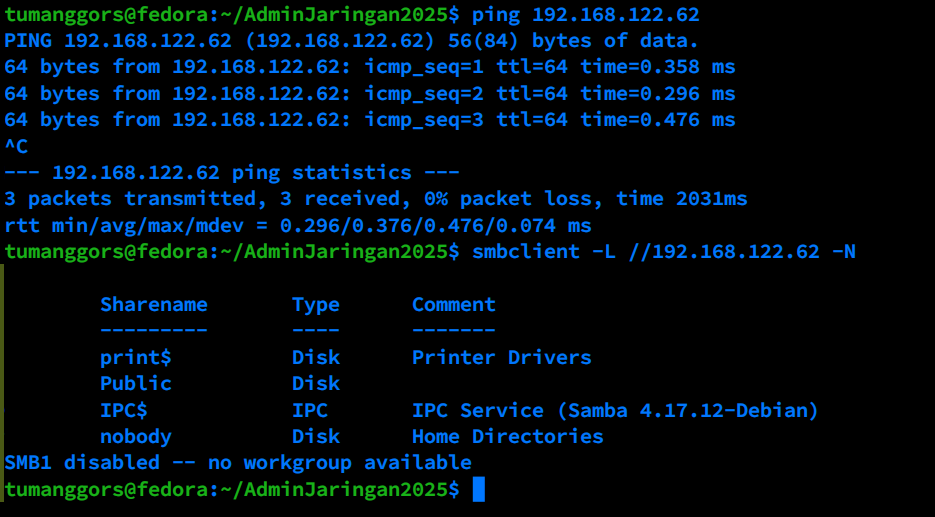

# Penggunaan NALA sebagai Pengganti APT di Debian 12

## 1. Pendahuluan

NALA adalah frontend CLI (Command Line Interface) untuk APT (Advanced Package Tool) yang dirancang untuk meningkatkan pengalaman pengguna dalam mengelola paket di Debian dan turunannya. Dengan antarmuka yang lebih user-friendly, NALA menawarkan berbagai keunggulan dibandingkan APT tradisional, seperti pemilihan mirror tercepat, output yang lebih informatif, dan dukungan pembaruan paralel.

## 2. Konsep Dasar

### 2.1 Repositori Paket dan Mirror

#### Apa itu Repositori Paket?
Repositori paket adalah koleksi perangkat lunak (paket) yang dapat diinstal pada sistem operasi berbasis Linux seperti Debian. Repositori ini berisi program, library, atau file konfigurasi yang diperlukan untuk menjalankan perangkat lunak.

#### Apa itu Mirror?
Mirror adalah salinan repositori utama yang tersedia di berbagai server di seluruh dunia. Tujuannya adalah untuk:
- **Meningkatkan kecepatan unduhan**, karena pengguna akan terhubung ke mirror terdekat.
- **Menyediakan redundansi**, jika satu mirror down, sistem dapat beralih ke mirror lain.
- **Mendistribusikan beban server**, sehingga server utama tidak terlalu terbebani.

### 2.2 Keunggulan NALA dibandingkan APT

1. **Manajemen Source List yang Lebih Baik**
   - Memudahkan pengguna dalam menambahkan, menghapus, atau memodifikasi daftar repositori.
   - Memilih mirror tercepat secara otomatis untuk mempercepat proses unduhan.

2. **Antarmuka yang Lebih User-Friendly**
   - Output yang lebih terstruktur dan mudah dibaca.
   - Warna dan format teks yang lebih jelas dibandingkan APT tradisional.

3. **Fitur Tambahan**
   - Mendukung pembaruan paralel untuk mempercepat instalasi paket.
   - Opsi untuk mengunduh paket tanpa langsung menginstalnya.
   - Riwayat transaksi yang lebih informatif.

4. **Kompatibilitas dengan APT**
   - Semua perintah dan opsi APT dapat digunakan dalam NALA.

## 3. Instalasi NALA di Debian 12

### 3.1 Update dan Upgrade Sistem
Sebelum menginstal NALA, pastikan sistem Anda dalam kondisi terbaru:
```bash
sudo apt update && sudo apt upgrade -y
```

### 3.2 Instalasi NALA
Gunakan perintah berikut untuk menginstal NALA:
```bash
sudo apt install nala
```

## 4. Konfigurasi NALA

Setelah instalasi, jalankan perintah berikut untuk mengonfigurasi mirror tercepat:
```bash
sudo nala fetch
```
Perintah ini akan menguji berbagai mirror dan memilih yang tercepat berdasarkan lokasi Anda.


Gambar di atas adalah contoh hasil dari perintah `nala fetch` yang dijalankan di komputer saya yang berlokasi di Surabaya, Jawa Timur, Indonesia.


## 5. Penggunaan Dasar NALA

| Perintah | Fungsi |
|----------|--------|
| `sudo nala update` | Memperbarui daftar paket dari repositori |
| `sudo nala upgrade` | Memperbarui daftar paket dan meng-upgrade sistem |
| `sudo nala install <nama_paket>` | Menginstal paket tertentu |
| `sudo nala remove <nama_paket>` | Menghapus paket yang terinstal |
| `sudo nala clean` | Membersihkan arsip paket yang telah diunduh |
| `sudo nala autopurge` | Menghapus paket yang tidak lagi diperlukan |
| `sudo nala autoremove` | Menghapus paket yang tidak lagi digunakan |
| `sudo nala fetch` | Memilih mirror tercepat untuk unduhan |
| `sudo nala history` | Menampilkan riwayat transaksi |
| `sudo nala list` | Menampilkan daftar paket berdasarkan nama |
| `sudo nala purge <nama_paket>` | Menghapus paket beserta konfigurasinya |
| `sudo nala search <kata_kunci>` | Mencari nama dan deskripsi paket |
| `sudo nala show <nama_paket>` | Menampilkan detail paket |


## 7. Kesimpulan

NALA adalah alat yang sangat berguna untuk mengelola paket di Debian 12. Dengan antarmuka yang lebih ramah pengguna, manajemen source list yang lebih baik, serta fitur-fitur tambahan seperti pembaruan paralel dan riwayat transaksi, NALA meningkatkan efisiensi dan kenyamanan dalam pengelolaan sistem.

Untuk informasi lebih lanjut, kunjungi [repositori resmi NALA di GitHub](https://gitlab.com/volian/nala).

