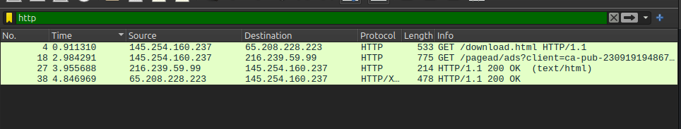

# Tugas Workshop Administrasi Jaringan [REVIEW]

## Tugas 1: Analisa file http.cap

1. **Download File**
    - Download `http.cap` di [SampleCaptures](https://wiki.wireshark.org/SampleCaptures)

2. **Eksplorasi dan Analisis di Wireshark**
    
    - **IP Server dan Client**: 
      - Identifikasi IP server dan client dari file capture.
    - **Versi HTTP**: 
      - Tentukan versi HTTP yang digunakan.
    - **Waktu Client Mengirim Request**: 
      - Catat waktu ketika client mengirim request.
    - **Waktu Server Menerima HTTP Request dari Client**: 
      - Catat waktu ketika server menerima request dari client.
    - **Waktu Transfer dan Response**: 
      - Hitung waktu yang dibutuhkan untuk transfer dan response dari client ke server.

3. **Langkah-langkah Pengerjaan**
    - Langkah 1: Buka Wireshark dan load file `http.cap`.
    - Langkah 2: Gunakan filter untuk menampilkan paket HTTP.
    - Langkah 3: Analisis setiap paket untuk mendapatkan informasi yang diminta.
    - Langkah 4: Catat hasil analisis dalam dokumen.

## Tugas 2: Analisis Gambar

1. **Figure 23.1 Types of Data Deliveries**
    - Jelaskan proses yang terjadi dalam gambar tersebut.
    - Berikan penjelasan detail mengenai setiap tipe pengiriman data yang ditampilkan.

## Tugas 3: Resume

1. **Tahapan TCP**
    - **Establishment**: 
      - Jelaskan proses establishment dalam TCP.
    - **Data Transfer**: 
      - Jelaskan bagaimana data ditransfer dalam TCP.
    - **Termination**: 
      - Jelaskan proses termination dalam TCP.
